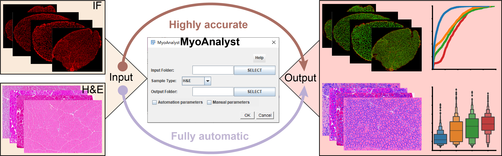

# MyoAnalyst
Thank you for your interest in MyoAnalyst. it is an imageJ (FIJI) plugin to segment and measure size of skeletal muscle fibers.

## Installation and User Manual
Please  refer to the "MyoAnalyst User Manual.pdf" file in the documentaion folder.

## Help
In case of difficulties using the plugin, create an issue in the following link so we or someone from the community can help you:
https://github.com/ZhangHongbo-Lab/MyoAnalyst/issues. Or you can contact us: zhangbao5@mail.sysu.edu.cn
