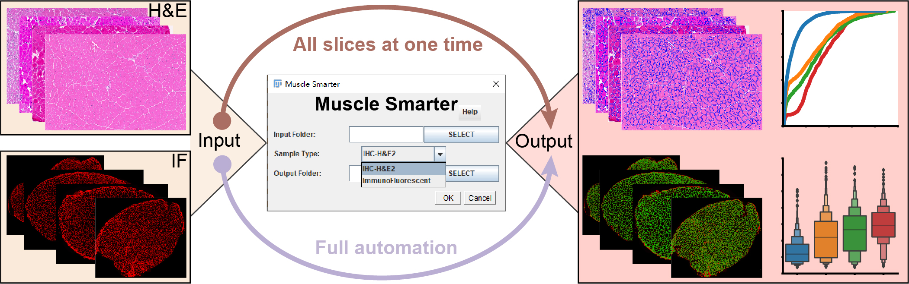

# MyoAnalyst
Thank you for your interest in MyoAnalyst. it is an imageJ (FIJI) plugin to segment and measure size of skeletal muscle fibers.

## Installation
1. Download the “MyoAnalyst_v1.0.jar” from the links above.

2. Copy the  “MyoAnalyst_v1.0.jar” file into the FIJI plugins folder and restart the program. You will find the plugin in the “plugins” tab of FIJI.

## Usage and Documentation
### 1. segmentation and measure skeleta muscle cross-section stained by immunofluorescence (IF):  
It is worth noting that for images stanined by immunofluorescence, single channel images of myofiber boundary staining are only required; 
the `Input Folder`: a folder that contains the image files which have the same staining (IF or H&E ) to be analyzed; 
the `Sample Type `: Specifing the staining technique as "IF" through the drop-down list; 
the `Output Folder`: a folder in which to save the output data following image analysis.; 
### 2. segmentation and measure skeleta muscle cross-section stained by H&E:  
the `Input Folder`: a folder that contains the image files which have the same staining (IF or H&E ) to be analyzed; 
the `Sample Type `: Specifing the staining technique as "H&E" through the drop-down list; 
the `Output Folder`: a folder in which to save the output data following image analysis.; 
## Help
In case of difficulties using the plugin, create an issue in the following link so we or someone from the community can help you:
https://github.com/ZhangHongbo-Lab/MyoAnalyst/issues.
